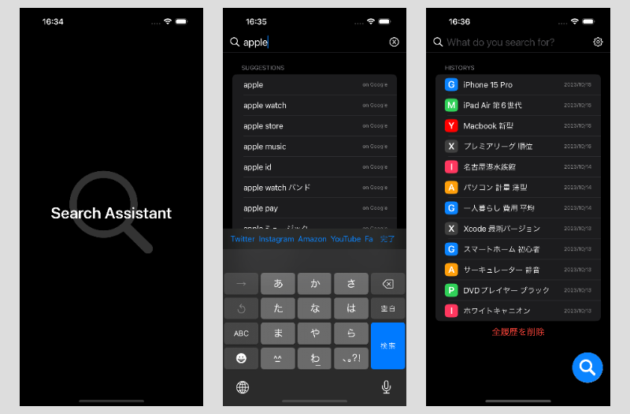

**Search Assistant - すぐに検索、手軽に発見**

**概要** 「Search Assistant」は、いつでもどこでも素早く検索を開始できるiOSアプリです。ロック画面からワンタップで始まるスマートな検索を提供します。

**主な機能**

*   **ロック画面ウィジェットからの即時アクセス**: ロック画面から直接アプリを開けるため、検索が驚くほど迅速に行えます。
*   **自動キーボード表示**: アプリを開くと即座にキーボードが表示され、検索語の入力が可能です。スムーズな検索体験を提供します。
*   **豊富な検索オプション**: Googleの検索だけでなく、Twitter、Instagram、Amazon、YouTube、Facebook、メルカリ、ラクマ、PayPayフリマなど、多様なプラットフォームでの検索がこのアプリ一つで可能です。
*   **検索履歴の管理**: いつ何を検索したかの履歴が自動で保存され、過去の検索を簡単に確認できます。

**ターゲットユーザー** 情報収集や日々の疑問解決をすばやく行いたいユーザーに最適です。ビジネスパーソン、学生、情報を素早く手に入れたいすべての人に役立ちます。

**使い勝手の良さ** シンプルなインターフェースと高速な検索機能で、検索体験がこれまでになく快適に。情報はすぐそこに、あなたの指先一つでアクセス可能です。

**ダウンロード** 「Search Assistant」はApp Storeで今すぐにダウンロードいただけます。情報検索の新しいスタンダードを、このアプリで体験してください。
 https://apps.apple.com/jp/app/search-assistant/id1659684669?itsct=apps_box_link&itscg=30200