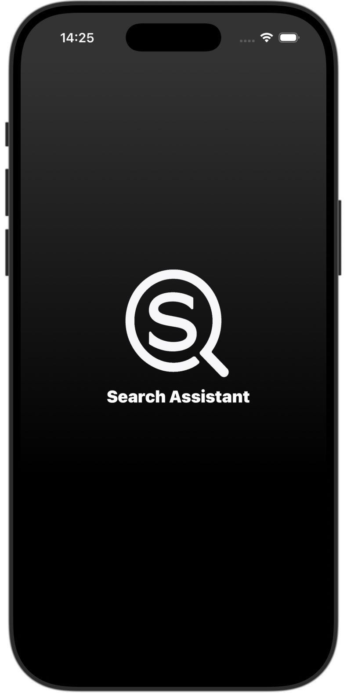
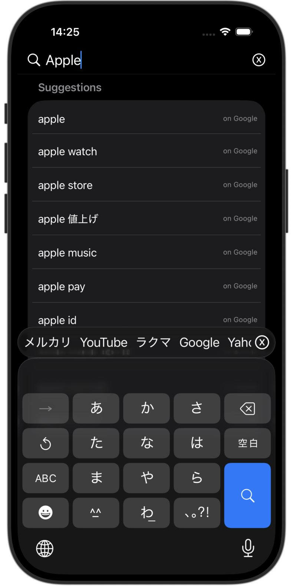
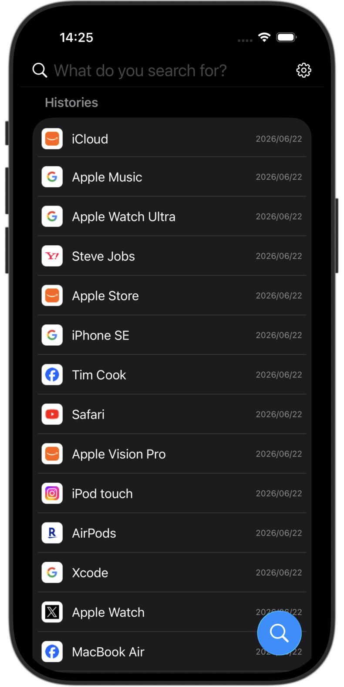

# Search Assistant

すぐに検索、手軽に発見。Search Assistant は、検索したいときにすばやく入力を始め、好みのサービスで検索できる iOS アプリです。

  
  
  

## 主な機能

- 検索画面を開くとキーボードを自動表示し、すぐに入力できます。
- 入力に応じて Google の検索候補を表示します。
- Google、X、Instagram、Amazon、YouTube、Facebook、メルカリ、ラクマ、Yahoo!フリマで検索できます。
- 検索履歴を保存し、タップで再検索できます。履歴は最大 3,000 件まで保持され、上限を超えると古いものから自動で削除されます。
- ロック画面の円形ウィジェットから、アプリをすばやく開けます。

## 設定

- キーボードの自動表示
- 検索ボタンの左利き用配置
- ライト・ダーク・システムから選べる外観モード
- アプリ内ブラウザまたは Safari での検索結果の表示
- サーチボタンバーに表示する検索先の有効化と並び順

## 動作要件

- iOS 26.0 以降

## 開発

1. `SearchAssistant.xcodeproj` を Xcode で開きます。
2. `SearchAssistant` スキームを選択し、iOS 26.0 以降のシミュレータまたは実機で実行します。

ローカル Swift Package として、検索 URL の生成を `SearchCore`、検索候補の取得を `SearchSuggestion` に分離しています。

## ダウンロード

[App Store から Search Assistant をダウンロード](https://apps.apple.com/jp/app/search-assistant/id1659684669?itsct=apps_box_link&itscg=30200)
